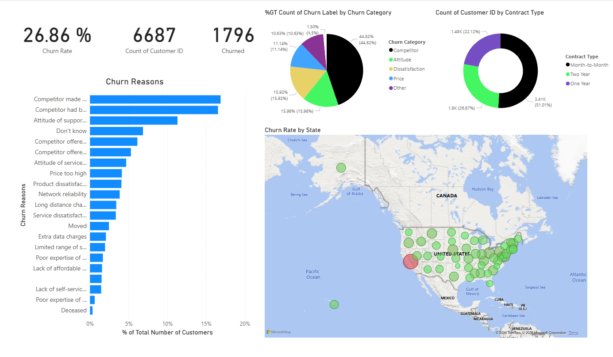
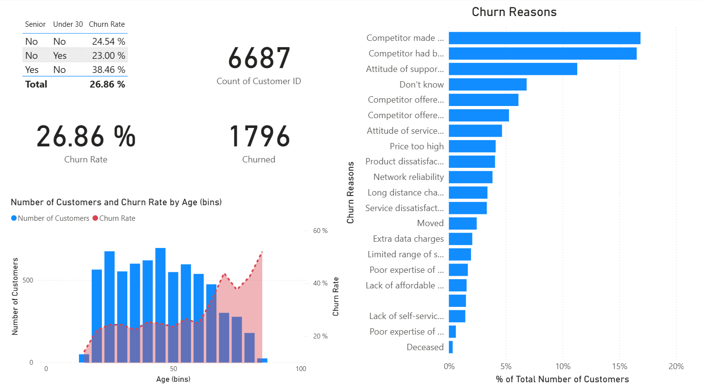
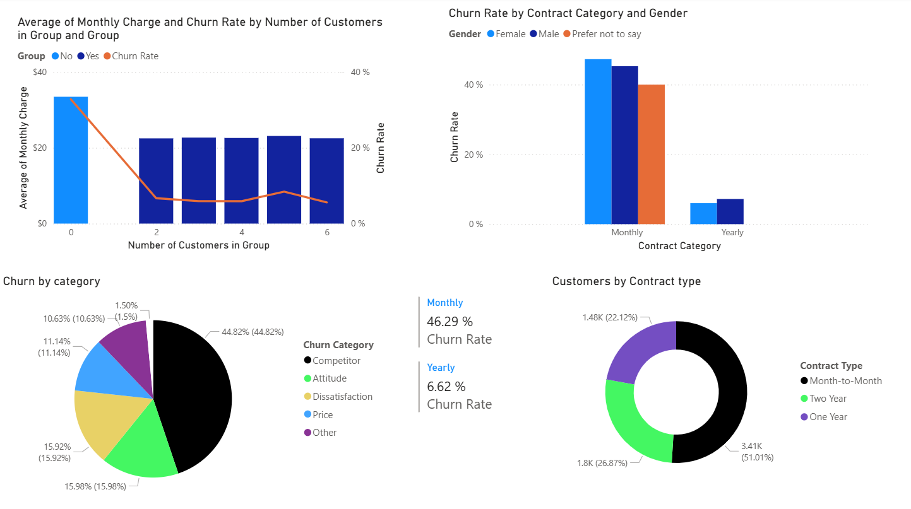
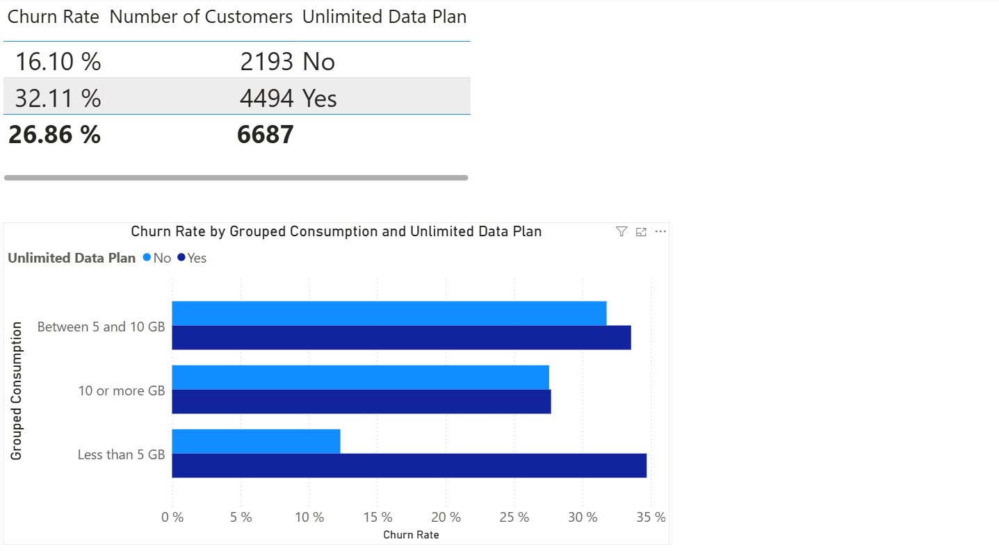
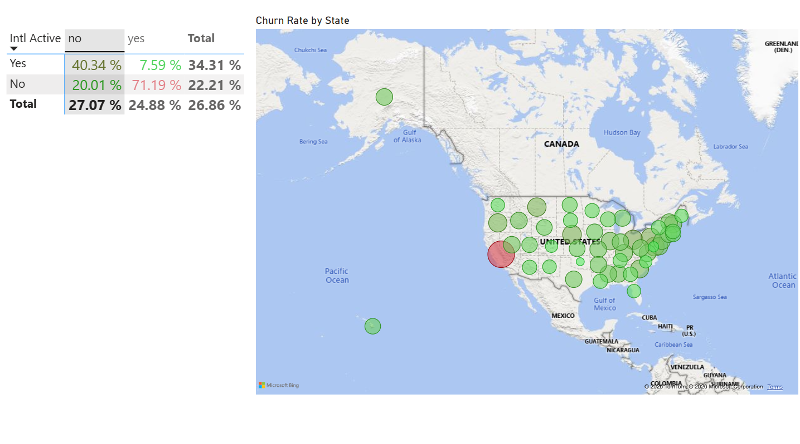
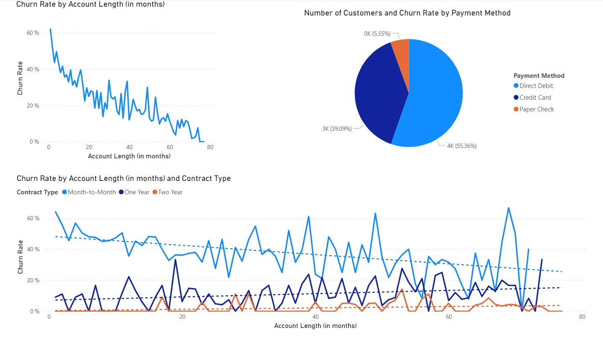
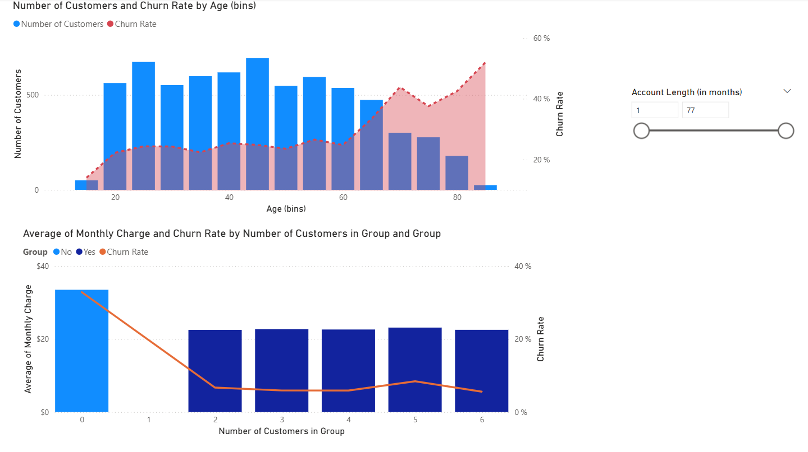
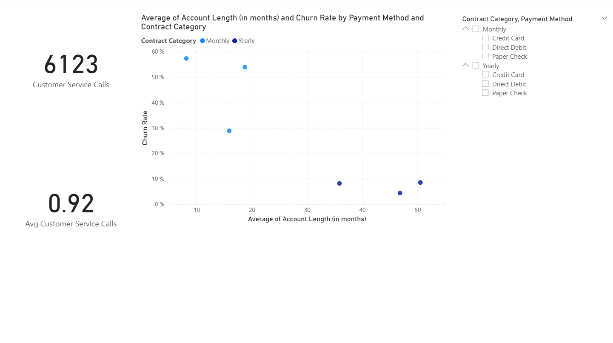
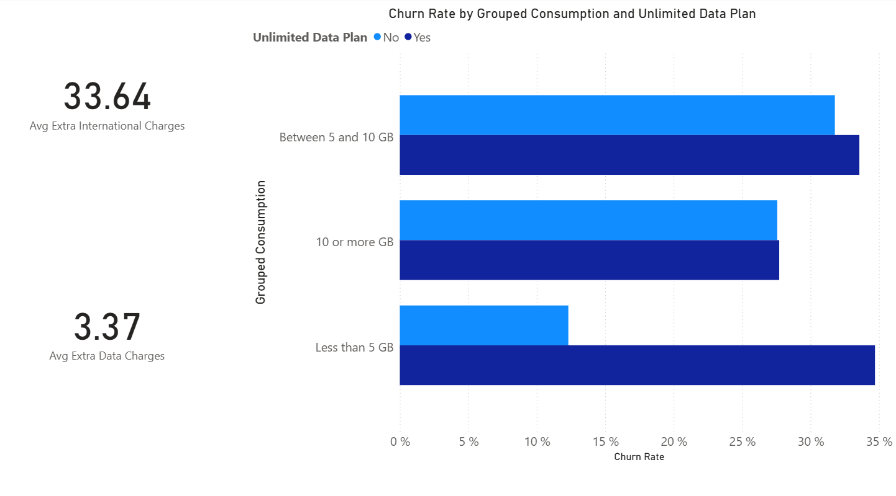
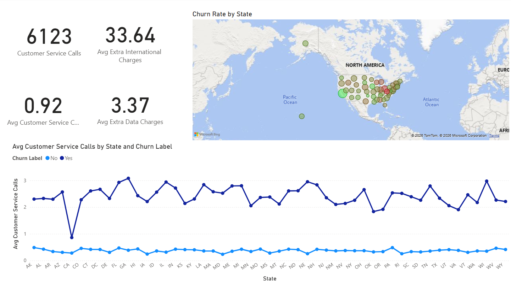

# Customer-Churn-Analysis-with-Power-BI-
# 📊 Power BI Dashboard Project

## 📌 Project Overview

This project present interactive data analysis dashboards built using **Power BI**. These dashboards provide insights into key business metrics, trends, customer behavior, and performance indicators through dynamic visualizations and reports.

The goal of this project is to transform raw data into meaningful insights that support data-driven decision-making.

---

# 🛠️ Tools & Technologies Used

* **Power BI** – Dashboard creation and visualization
* **SQL** – Data extraction and transformation
* **Excel / CSV** – Data source and preprocessing
* **Power Query** – Data cleaning and transformation
* **DAX (Data Analysis Expressions)** – Measures and calculated columns

---

# 📂 Project Structure

```bash
├── Dataset/
├── Dashboard.pbix
├── Screenshots/
├── README.md
```

---

# 📈 Dashboard Pages

## 1️⃣ Overview

### 📌 Description

This page provides a high-level summary of customer churn metrics, KPIs, and overall business performance.

### 🔍 Key Insights

* Total Customers
* Churn Rate
* Revenue Overview
* Customer Distribution
* Key Performance Indicators

### 🖼️ Dashboard Screenshot





---

## 2️⃣ Churn Demographics

### 📌 Description

This dashboard focuses on customer demographics and how different demographic groups contribute to churn.

### 🔍 Key Insights

* Gender Distribution
* Age-Based Churn Analysis
* Demographic Segmentation
* Customer Profiles
* Churn by Customer Type

### 🖼️ Dashboard Screenshot





---

## 3️⃣ Groups and Categories

### 📌 Description

This page analyzes customer groups and categories to identify patterns and trends related to churn.

### 🔍 Key Insights

* Customer Segmentation
* Category-Based Analysis
* Behavioral Trends
* Churn Comparison Across Groups
* High-Risk Customer Categories

### 🖼️ Dashboard Screenshot





---

## 4️⃣ Unlimited Plan

### 📌 Description

This dashboard examines customer behavior and churn trends related to unlimited subscription plans.

### 🔍 Key Insights

* Unlimited Plan Adoption
* Churn by Plan Type
* Usage Trends
* Plan Retention Analysis
* Customer Preferences

### 🖼️ Dashboard Screenshot





---

## 5️⃣ International Calls

### 📌 Description

This page explores the impact of international calling activity on customer churn.

### 🔍 Key Insights

* International Call Usage
* Churn Rate by Call Activity
* Customer Communication Patterns
* Usage Comparison
* Revenue Impact

### 🖼️ Dashboard Screenshot





---

## 6️⃣ Contract Type

### 📌 Description

This dashboard analyzes how different contract types influence customer retention and churn.

### 🔍 Key Insights

* Monthly vs Yearly Contracts
* Churn by Contract Duration
* Retention Trends
* Contract-Based Customer Segments
* Customer Loyalty Analysis

### 🖼️ Dashboard Screenshot





---

## 7️⃣ Age Groups

### 📌 Description

This page focuses on churn behavior across different customer age groups.

### 🔍 Key Insights

* Age Group Distribution
* Churn by Age Category
* Customer Engagement Trends
* Retention Analysis
* Demographic Insights

### 🖼️ Dashboard Screenshot





---

## 8️⃣ Payment and Contract

### 📌 Description

This dashboard combines payment methods and contract information to analyze churn patterns.

### 🔍 Key Insights

* Preferred Payment Methods
* Contract and Payment Correlation
* Churn by Payment Type
* Revenue Trends
* Customer Retention Patterns

### 🖼️ Dashboard Screenshot





---

## 9️⃣ Extra Charges

### 📌 Description

This page analyzes additional charges and their relationship with customer churn.

### 🔍 Key Insights

* Additional Service Charges
* Churn by Extra Costs
* Billing Analysis
* Customer Spending Trends
* Revenue Contribution

### 🖼️ Dashboard Screenshot





---

## 🔟 Insights

### 📌 Description

This page contains final analytical insights and summarized findings from the dataset.

### 🔍 Key Insights

* Overall Churn Patterns
* Business Recommendations
* Trend Analysis
* Key Risk Factors
* Strategic Insights

### 🖼️ Dashboard Screenshot





---

# 📊 Features

* Interactive visualizations
* Dynamic filtering and slicers
* Drill-through analysis
* KPI tracking
* User-friendly dashboard layout
* Data-driven storytelling

---

# 🚀 How to Use

1. Download the `.pbix` file.
2. Open the project in **Power BI Desktop**.
3. Refresh the dataset if required.
4. Explore the dashboards using filters and slicers.

---

# 📷 Adding Screenshots

1. Create a folder named `Screenshots` in your GitHub repository.
2. Export dashboard screenshots from Power BI.
3. Save them inside the `Screenshots` folder.
4. Replace the placeholder image names in this README with your actual screenshot file names.

---

# 📌 Future Improvements

* Add predictive analytics
* Integrate real-time data sources
* Enhance mobile responsiveness
* Add advanced DAX calculations
* Deploy dashboard to Power BI Service

---
